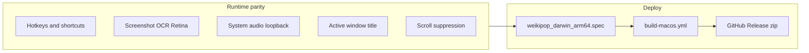

# Mac arm64 deploy with feature parity

The app already has Darwin scaffolding (`IS_MACOS`, PyObjC deps, hold-to-scan hotkey, popup focus restore, Application Support paths). What is missing is **feature parity in input/audio/window-title**, plus **packaging/CI** so a Mac user can download a zip from GitHub like they do on Windows.

You are on Windows, so the binary will be produced by GitHub Actions (`macos-latest` = Apple Silicon). Magpie stays Windows-only (already hidden in settings).

## 1. Input and shortcuts (currently broken on Mac)

[`src/gui/input.py`](src/gui/input.py): `MacOSKeyboardController.is_key_pressed` always returns `False`, so default **Alt+A** (Anki), **Alt+C** (copy), and **Alt+Wheel** (popup scroll) do nothing.

- Parse combos (`alt+a`, `cmd+shift+c`) the same way Windows `keyboard.is_pressed` does.
- Modifiers: `NSEvent.modifierFlags()` (already used for the hold hotkey).
- Keys: `Quartz.CGEventSourceKeyState` plus a small ANSI keycode map.
- Treat `option` as an alias of `alt`.
- Add `cmd` / `cmd+…` items to the hotkey combo in [`src/gui/settings_dialog.py`](src/gui/settings_dialog.py).
- Fix the unused `keycodes_to_check` overwrite in `__init__` (harmless today, but misleading).

**Scroll suppression** (Windows `WH_MOUSE_LL` hook): add a Mac `CGEventTap` on a daemon thread that swallows scroll events while `input_loop.suppress_scroll` is True. If the tap cannot be created (no Accessibility permission), log a warning and continue — same graceful fallback as Windows.

## 2. Sentence audio (currently Windows-only)

[`src/utils/audio_capture.py`](src/utils/audio_capture.py) uses WASAPI via `soundcard`. Keep the ring-buffer / `grab_wav()` API; add a Darwin backend with **ScreenCaptureKit** (system audio, no BlackHole install):

- New deps (darwin): `pyobjc-framework-ScreenCaptureKit`, `pyobjc-framework-CoreMedia`, plus explicit `numpy` (already pulled in on Windows by `soundcard`).
- Capture audio-only `SCStream` into the existing float32 ring buffer.
- Requires macOS 13+ and Screen Recording permission; if unavailable, `available()` stays False and mining continues without `{sentence-audio}`.
- Update the settings tooltip that currently says "Windows only."

## 3. OCR on Mac (same engines, Mac screenshot + Retina coords)

OCR is **not a new Mac engine**. The pipeline stays: `mss` screenshot → PIL image → chosen provider `scan()` → hit-scan under the cursor → dictionary popup. Providers are already Python/HTTP and do not use Win32.

**What the user selects in Settings / tray (unchanged):**

- **meikiocr (local)** — default in config. ONNX Japanese OCR via the `meikiocr` package. Runs on Apple Silicon through `onnxruntime` (CPU; no CUDA). Pin `onnxruntime` for `darwin` as well as `win32` so the Mac wheel is in the `.app`. First run may download models (same as Windows).
- **Google Lens (remote)** — HTTP; works on Mac with `WEIKIPOP_GLENS_API_KEY`.
- **owocr (Websocket)** — talks to a local owocr server at `127.0.0.1:7331`; works if the user runs owocr on the Mac.
- **Chrome Screen AI (local)** — optional user-supplied `libchromescreenai.dylib` (not shipped). Same “bring your own binary” model as Windows/Linux.

**Mac-specific requirements for OCR to actually work:**

- **Screen Recording** permission — without it `mss` captures a blank/black desktop and OCR sees nothing. Prompt + README.
- **Retina coordinates** — `mss` geometry is physical pixels; pynput/Qt cursor is logical points (2x on most MacBooks). Region selection already multiplies by `devicePixelRatio`; [`src/ocr/hit_scan.py`](src/ocr/hit_scan.py) does not (Mac Magpie stub is a no-op). Scale mouse into the screenshot’s pixel space so hover-lookup lands on the right character. Same ratio for popup placement if needed.
- Bundle meikiocr/onnxruntime in the PyInstaller spec hiddenimports so local OCR works offline from the `.app`.

## 4. `{document-title}` and Screen AI path

- [`src/utils/window_info.py`](src/utils/window_info.py): Darwin implementation via `CGWindowListCopyWindowInfo` (frontmost on-screen window name), with the same browser-suffix stripping as Windows. Needs Screen Recording on recent macOS to see titles.
- [`src/ocr/providers/screenai/provider.py`](src/ocr/providers/screenai/provider.py): add `libchromescreenai.dylib` and `~/Library/Application Support/screen_ai` on Darwin. Still user-supplied (same as Win/Linux); default OCR remains meikiocr.

## 5. Mac-specific UX glue

- Default font: do not force `Segoe UI` on Darwin (use the Qt system UI font).
- First-run permission note (dialog or README + tray log): **Accessibility** (mouse/hotkeys/scroll tap) and **Screen Recording** (screenshots + audio + window titles). Offer a button that opens System Settings → Privacy.
- Frozen Mac app: also write logs to `~/Library/Application Support/weikipop/weikipop.log` because a windowed `.app` has no console ([`src/utils/logger.py`](src/utils/logger.py)).
- Builtin `dictionary.pkl`: resolve from user data dir, then `_MEIPASS`, then cwd. Double-clicking a `.app` sets cwd to `/`, so the Windows sidecar layout would miss the dictionary.

## 6. Packaging (unsigned `.app` zip)

Add [`weikipop_darwin_arm64.spec`](weikipop_darwin_arm64.spec) modeled on [`weikipop_linux_x64.spec`](weikipop_linux_x64.spec):

- `EXE` + `BUNDLE` named `Weikipop.app`, `console=False`, `target_arch='arm64'`.
- Bundle OCR provider modules, `data/deconjugator.json`, icons, and `dictionary.pkl`.
- `Info.plist`: `CFBundleIdentifier` (e.g. `com.weikipop.app`), `LSUIElement=1` (menu-bar / tray app, no dock bounce), usage strings for Screen Recording / Accessibility.
- Generate `icon.icns` in CI from existing `src/resources/icon.ico` (`sips`/`iconutil` or Pillow).
- No code signing / notarization. Zip as `weikipop.macos.arm64.zip` containing `Weikipop.app`.

## 7. CI and docs

- New [`.github/workflows/build-macos.yml`](.github/workflows/build-macos.yml): `macos-latest`, Python 3.12, `pip install -r requirements.txt pyinstaller`, build dictionary, `pyinstaller weikipop_darwin_arm64.spec`, zip, upload artifact `weikipop-macos-arm64`.
- Wire into [`.github/workflows/release.yml`](.github/workflows/release.yml) and [`.github/workflows/pr-build.yml`](.github/workflows/pr-build.yml) next to Windows/Linux.
- README: Mac download, Gatekeeper (**right-click → Open** the first time), required TCC permissions, macOS 13+ for sentence audio.

## Out of scope / honest limits

- **Magpie compatibility**: Windows-only third-party scaler; already gated with `IS_WINDOWS`.
- **Notarization**: skipped by your choice; unsigned apps show a Gatekeeper warning.
- **Intel Macs**: not built.
- End-to-end Mac QA cannot be done on this Windows machine; verification is CI artifact + a real Mac (permissions, Retina hit-scan, audio mine).
